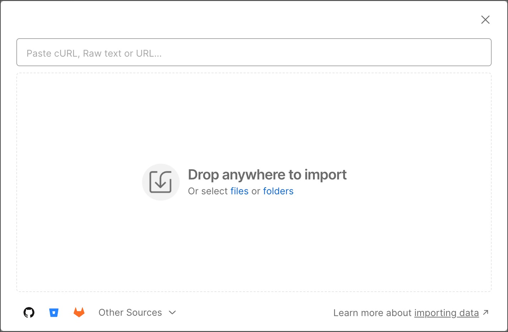
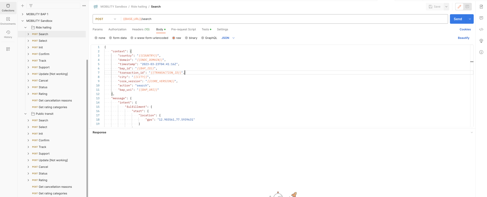
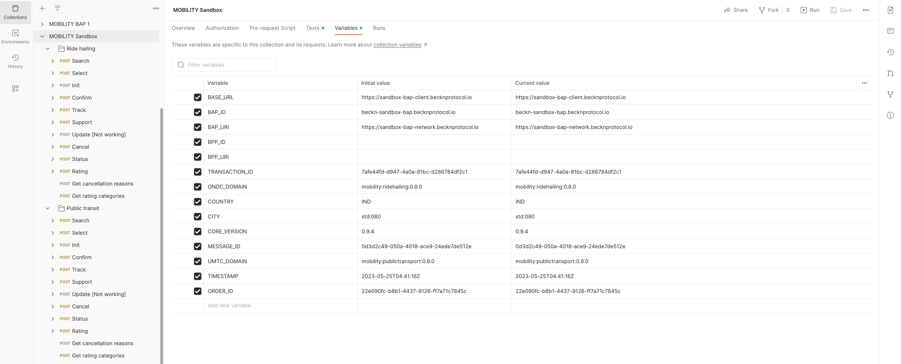

# Sandbox User Guide

<!--Before making the request to sandbox api's, you need to have the [Postman](https://www.postman.com/downloads/) tool. Please follow the further steps to install the postman on specific OS.-->

Before initiating a request to the sandbox APIs, it is essential to have the Postman tool installed. Please proceed with the following steps to install Postman on your specific operating system.

## Installing Postman on Windows

To install Postman on a Windows system, follow the instructions outlined in the [Windows installation guide](https://learning.postman.com/docs/getting-started/installation-and-updates/#installing-postman-on-windows).

## Installing Postman on Mac

To install Postman on a Mac, please refer to the [installation guide for macOS](https://learning.postman.com/docs/getting-started/installation-and-updates/#installing-postman-on-mac).

## Installing Postman on Linux

For Linux, you can follow the instructions provided in the [installation guide for Linux](https://learning.postman.com/docs/getting-started/installation-and-updates/#installing-postman-on-linux) to install Postman.

Once you have completed the Postman installation process, please proceed to import the collection using the following steps.

## Import Collection in Postman

You can easily import collections, API specifications, and data files directly into Postman. Here's how to do it:

1. Open Postman and click on the "Import" option located in the upper left corner. This will open the Import modal.

1. To import your Postman collection, select the option to import a file from your local storage.
2. Download the desired collection using the following links:
    - [DSEP Collection](https://raw.githubusercontent.com/beckn/beckn-sandbox/main/artefacts/DSEP/dsep-services-sandbox.postman_collection.json)
    - [Mobility Collection](https://raw.githubusercontent.com/beckn/beckn-sandbox/main/artefacts/Mobility/mobility-services-sandbox.postman_collection.json)
    - [Financial Services Collection](https://raw.githubusercontent.com/beckn/beckn-sandbox/main/artefacts/financial-services/financial-services.postman_collection.json)
    - [DENT Protocol Collection](https://raw.githubusercontent.com/beckn/beckn-sandbox/main/artefacts/DENT/DENT-protocol-sandbox.postman_collection.json)
    - [DHP Collection](https://raw.githubusercontent.com/beckn/beckn-sandbox/main/artefacts/DHP/DHP-sandbox.postman_collection.json)
3. Once you have successfully imported a collection, you will find it listed in the left sidebar under the name `MOBILITY Sandbox`. Within this collection, you will discover two folders named `Ride Hailing` (ONDC) and `Public transit` (UMTC). (ONDC) and `Public transit` (UMTC).

## Making Requests to Sandbox API in Postman

Within the collection's `Ride hailing` folder, you will find a list of API requests. To make a request and retrieve a response, follow these steps:

1. Open the desired request within the folder by clicking on it.
2. In the request window, locate and click the `Send` button, as depicted in the image below:
   
3. The image illustrates the request method as `POST`, the URL as `{{BASE_URL}}/search`, which represents the endpoint for the sandbox search API, and a raw JSON body for the request. You can modify these parameters as needed to customize your request.

Feel free to make adjustments to the request method, URL, or request body as required for your specific use case. Once you hit the `Send` button, Postman will execute the request, and you will receive the corresponding response.

## Debugging Sandbox Request / Response

There is a robust logging activated on the BAP and BPP part of the sandbox, which will allow the user to debug all request and response genreated by the sandbox. the logs are externalised and can be accessed by following the below links.

1. BAP Client: https://ps-bap-client.becknprotocol.io/logs
2. BAP Network: https://ps-bap-network.becknprotocol.io/logs
3. BPP Client: https://sandbox-bpp-client.becknprotocol.io/logs
4. BPP Network: https://sandbox-bpp-network.becknprotocol.io/logs

The logs will provided details about

1. Complete end to end BAP / BPP transaction
2. Error messages if any related to beckn schema validation
3. Error messages if any related to req / res signature validation
4. Any BAP / BPP internal errors

## Collection Variables

You may have noticed that the URL and request JSON body contain variables such as `{{BASE_URL}}, {{COUNTRY}}, {{BAP_ID}}, {{TRANSACTION_ID}}`. These variables are defined at the collection level. To access and manage these variables, follow these steps:

1. Click on the collection name, which is `MOBILITY Sandbox`.
2. Choose the `variables` tab, as illustrated in the image below:
   
   Here, you can view and edit the collection-level variables, allowing you to customize and adjust them as needed for your API requests within the collection.

## Modifying Sandbox API Code

### Modifying Request in Sandbox API

To make changes to a request, you'll need to update the JSON body in Postman. Additionally, any changes to the request require corresponding adjustments to the sandbox changes in the request Data Transfer Objects (DTOs). Here's how to proceed:

1. Identify the list of DTOs for `Ride hailing (ONDC)` at the location `src/ondc/dto` and for `Public transit (UMTC)` at `src/umtc/dto`. The filename in the list corresponds to the specific request action. For example, for a search request, the DTO file is `src/ondc/dto/search-request.dto.ts`.
2. Modify the JSON body in Postman to reflect the changes you want to make to the request.
3. Ensure that you update the respective DTOs in your codebase to align with the changes you made in Postman. This synchronization ensures that the request is correctly handled on the server side.

### Modifying Response in Sandbox API

The response in the codebase is mocked for testing purposes. These mocked JSON files are stored separately in the codebase, and you can access the list of JSON files at `src/ondc/response` for ONDC and `src/umtc/response` for UMTC. Here's how to update the response:

1. Locate the appropriate JSON file for the response you want to modify. For example, if you wish to make changes to the search response, find the file named `src/ondc/response/response.search.json`.
2. Make the necessary changes to the JSON file to reflect the desired modifications in the sandbox search API response.

Any updates you make to the response JSON files will be reflected in the response generated by the sandbox search API, allowing you to test and customize the API's behavior as needed.

## Setting Up Sandbox Code Locally

To set up the sandbox environment on your local machine and create a local playground, you will need to install and configure the following six applications:

1. BAP Client Protocol Server
2. BAP Network Protocol Server
3. BPP Client Protocol Server
4. BPP Network Protocol Server
5. Beckn Sandbox
6. Docker Desktop and Docker CLI

## Setting Up Instances of Sandbox

Below are the steps to setup a Protocol Server instances for your local development environment.

1. Clone Beckn Sandbox Repo:

    - Clone the [Beckn Sandbox Repo](https://github.com/beckn/beckn-sandbox)

2. Initialize and Install Dependencies:
    - In each cloned repository, switch to the `main` branch using `git checkout main`.
    - Run `npm install` in both repositories to install dependencies.

## Setting Up Instances of Protocol Server

Below are the steps to setup a Protocol Server instances for your local development environment.

1. Clone Beckn Protocol Server Repo:

    - Clone the [Beckn Protocol Server Repo](https://github.com/beckn/protocol-server) four times, creating separate codebase for each instance: BAP Client, BAP Network, BPP Client, and BPP Network.

2. Initialize and Install Dependencies:

    - In each cloned repository, switch to the `master` branch using `git checkout master`.
    - Run `npm install` in all four repositories to install dependencies.

3. Register Local BAP and BPP Networks:

    - Access the [Registry URL](https://registry.becknprotocol.io/login).
    - Log in using your Gmail ID.

4. Create Network Participants:

    - In the Registry, navigate to the admin tab and select "Network Participant."
    - Click the "+" icon to create entries for both the BAP and BPP networks.
    - Enter ParticipantIDs for each network, for BAP Network and BPP Network. (Note: We will call this as "subscriberIDs" going further.)

5. Configure Network Roles:

    - Edit the created entries for BAP and BPP networks.
    - Select the "Network Role Tab."
    - Choose the network domain (leave it blank for universal BAP/BPP).
    - Set the Type as "BAP" for BAP network and "BPP" for BPP network.
    - Enter the respective "SubscriberID" created in step 4.
    - Set the Status field to "subscribed."

6. Set Up Local Tunneling:

    - Install `localtunnel` globally using `npm install -g localtunnel`.
    - Run `lt --port <BAP/BPP network port> --subdomain <any subdomain>` for both BAP and BPP networks (use the same subdomain each time for consistency).

7. Update Registry URLs:

    - Copy the generated URLs and paste them in the URL field on the respective network role tab in the Registry.
    - Save the changes.

8. Configure Participant Keys:

    - In the Registry, navigate to the participant key tab for both BAP and BPP networks.
    - Click the "+" icon to add a participant key entry.
    - Provide a key (used as uniqueKey in default.yml).
    - Run `npm run generate-keys` in the codebase for both BAP and BPP networks.
    - Copy the generated public keys and paste them in the "Signing Public Key" and "Encryption Public Key" fields.
    - Set the Valid from date to the current date and the Valid until date to a date at least one year ahead.
    - Check the "Verified" checkbox and save the entry.

9. Configure Sandbox:

    - In the sandbox codebase, check the Port in `/src/main.ts`.
    - Run `lt --port <sandbox port> --subdomain <any subdomain>` to set up local tunneling for the sandbox.

10. Update Configuration Files:

-   In the BAP Client and BAP Network codebases, update the `config/default.yml` file with the following values:
    -   Private Key: Copy the private key generated in step 8.
    -   Public Key: Copy the public key generated in step 8.
    -   Subscriber Id: Copy the subscriber ID from the respective Registry entry.
    -   Subscriber Uri: Copy the subscriberUri from the Registry entry.
    -   Unique Key: Copy the participant-key from the Registry entry (participant key tab).
-   In the BPP Client and BPP Network codebases, update the `config/default.yml` file with the following values:
    -   Private Key: Copy the private key generated in step 8.
    -   Public Key: Copy the public key generated in step 8.
    -   Subscriber Id: Copy the subscriber ID from the respective Registry entry.
    -   Subscriber Uri: Copy the subscriberUri from the Registry entry.
    -   Unique Key: Copy the participant-key from the Registry entry (participant key tab).
    -   WebhookURL: Copy paste the URL that you generate by running localtunnel for sandbox

11. Docker and Docker CLI from [here](https://docs.docker.com/engine/install/).

12. Start Docker Containers:

    -   In the BAP Client codebase, run `docker-compose up -d` to start all the required Docker containers in the background.

13. Complete BPP Network Configuration:

    -   Follow steps 4 to 8 for BPP Network, replicating the process for BAP Network.

14. Postman Collection Variable Configurations:
    -   Update Postman collection properties with the following values:
        -   bap_uri: Use the localtunnel URL of BAP Network.
        -   bap_id: Use the subscriberID for BAP Network.
        -   base_url: Use the localhost URL of BAP Client.
        -   bpp_id: Use the subscriberID for BPP Network.
        -   bpp_uri: Use the localtunnel URL of BPP Network.
        -   core_version: Set it to 1.1.0. If newer versions are available, you can find them [here](https://github.com/beckn/protocol-specifications/releases), and then update it accordingly.
15. Run the Setup:
    Open separate terminals and run the respective commands for each component, as follows: 1. One for BAP Client: `npm run dev` 2. One for BAP Network: `npm run dev` 3. One for BAP Network localtunnel: Use the localtunnel command from step 6. 4. One for BPP Client: `npm run dev` 5. One for BPP Network: `npm run dev` 6. One for BPP Network localtunnel: Use the localtunnel command from step 6. 7. One for sandbox: `npm run start:dev` 8. One for sandbox localtunnel: Use the localtunnel command from step 8.

16. Complete the Setup:
    -   Access the Postman collection and initiate requests. You will receive responses from the sandbox.
    -   Your setup is now complete. :)

## Sandbox Architecture

The sandbox architecture consists of two main components: the architecture diagram and the sequence diagram.

### Architecture Diagram

<!--IMAGE GOES HERE-->

The architecture diagram provides an overview of the various components and their interactions within the sandbox environment. While the specific details may vary, the key elements typically include:

-   API Requests: These are initiated by users or applications and form the starting point of interactions within the sandbox.

-   BAP Client Protocol Server: Responsible for processing API requests and validating payloads before passing them to the BAP Network Protocol Server.

-   BAP Network Protocol Server: Receives requests from the BAP Client Protocol Server, performs payload validation, and manages the routing of requests to different components based on the API type.

-   Beckn Gateway App: Involved in handling certain API calls, such as Search API requests. It communicates with the BAP Network Protocol Server and generates responses.

-   BPPs (Beckn Protocol Partners): These entities interact with the BAP Network Protocol Server and may respond to requests. The interaction with BPPs can vary depending on the API type.

-   BPP Network Protocol Server: Manages communication between the BAP Network Protocol Server and the BPP Client Protocol Server, including payload validation.

-   BPP Client Protocol Server: Responsible for handling requests from the BPP Network Protocol Server and forwarding them to the Sandbox App.

-   Sandbox: The sandbox component processes incoming requests, performs required actions, and generates responses.

### Sequence Diagram

<!--IMAGE GOES HERE-->

The sequence diagram complements the architecture diagram by illustrating the flow of interactions and communications between the various components. It shows the chronological order of events and how data moves through the system. The key interactions typically involve:

-   API Requests: Initiated by users or applications, triggering the entire sequence of interactions.

-   Protocol Servers: Including the BAP Client Protocol Server, BAP Network Protocol Server, BPP Network Protocol Server, and BPP Client Protocol Server, these servers validate and route requests.

-   Gateway App: Involved in handling specific API calls and responding accordingly.

-   Sandbox: The central component where requests are processed and responses are generated.

Both the architecture and sequence diagrams together provide a comprehensive view of the sandbox's structure and the flow of data and interactions between its components.

## Flow of Data from Each Protocol Server and Sandbox Application

This sequence of steps illustrates how data flows between the various protocol servers and sandbox applications in the system.
The flow of data between various components in the system follows these steps:

1. You initiate the API request from the Postman collection.

2. This API request is directed to the BAP Client Protocol Server, which validates the payload. Subsequently, it forwards the same payload to the BAP Network Protocol Server.

3. The request now reaches the BAP Network Protocol Server, where payload validation takes place. If the payload is valid, the server behaves differently depending on the type of API call:

    - For Search API calls, it forwards the request to the Beckn Gateway App.
    - For other API calls, it directly communicates with the BPPs (Beckn Protocol Partners).

4. In the case of Search APIs, the Gateway App receives the request from the BAP Network Protocol Server and responds with an acknowledgment message to the protocol server.

5. The Gateway App then identifies all the BPPs falling under the domain specified in the payload. After verification, it sends the payload to each of the identified BPPs and waits for their responses.

6. The BPP Network Protocol Server processes requests received from the Gateway in the case of Search API calls and from the BAP Network Protocol Server for other API calls. It validates the payload and subsequently communicates with the BPP Client Protocol Server.

7. The BPP Client Protocol Server receives the request and sends it to the Sandbox App.

8. The sandbox processes the request and generates a response, which it provides to BPP Client Protocol Server.

9. The flow is reversed, with the response passing through the BPP Client Protocol Server, BPP Network Protocol Server, Beckn Gateway App, and finally back to the BAP Network Protocol Server.

10. This completes the entire data flow process.
